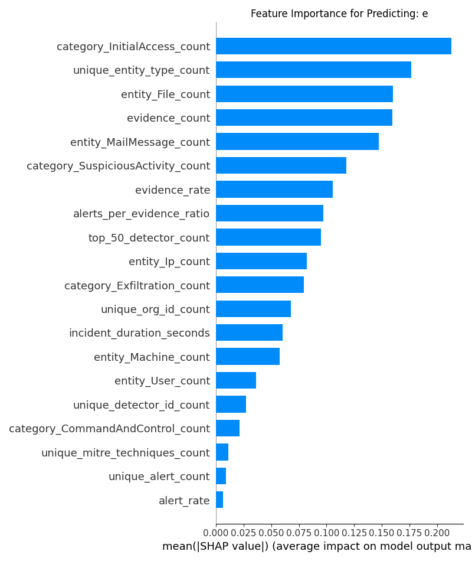
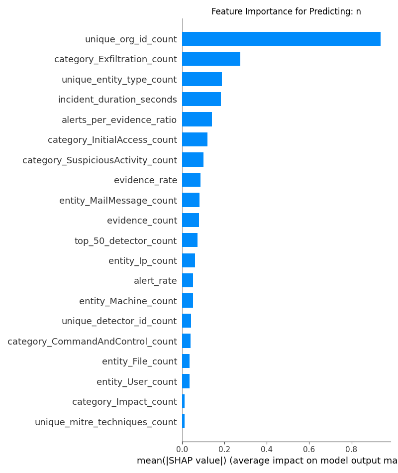
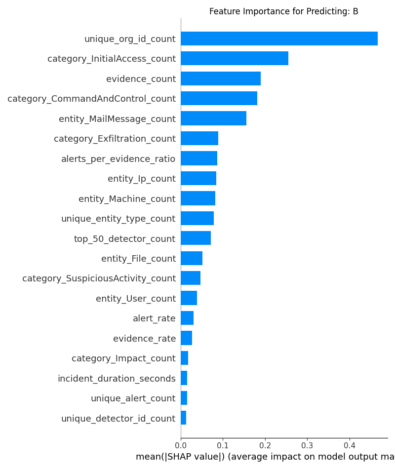

# Microsoft Security Incident Prediction

An end to end Machine Learning project to predict the triage grade of real world cybersecurity incidents using Microsoft's GUIDE dataset. This repository showcase a comprehensive workflow, from large scale data processing and advanced feature engineering to comparative model benchmarking and deep insights.

# 1. Introduction
In today's cybersecurity landscape, Security Operations Centers (SOCs) are inundated with a massive volutme of security alerts. The sheer number of potential threats makes it impossible for human analysis to manually investigate every single one. This "alert fatigue" can lead to critical threats being missed.

Machine Learning offers a powerful solution by automating the initial triage process. By learning from historical data,an ML model can access incoming security incidents and assign a preliminary grade, allowing analysts to focus their limited time and resources on the events that are most likely to be genuine, melivious attacks (`True Positives`).

This project tackles this challange head on by building a robust system to classify security incidents, demonstrating a data driven approach to enhancing cybersecurity operations.

# 2. Dataset Description
This project utilises the GUIDE (Guided Response Investigation Dataset), the largest publicly available collection of real world cybersecurity incidents, released by Microsoft.

**Key characteristics:**
    
* **Scale:** Over 13 million pieces of evidence across 1 milltion triage annotated incidents.
* **Diversity:** Telemetry from over 6,100 organisations, featuring 9,100 unique build in and custom `DetectorIds`.
* **Hierarchical Structure:** The data is organised in three levels:

    1. **Evidence:** The lowest level, representing individual logs or entities (e.g., an IP address, a file hash, a user account).
    2. **Alert:** A consolidation of one or more pieces of evidence that signifies a potential security event.
    3. **Incident:** The highest level, grouping one or more related alerts into a cohesive security narrative that requires triage.
* **Privacy:** All sensitive data has been rigorously anonymized through a multi stage process of hasing, randomization, and timestamp perturbation to protect privacy while preserving data utility.

# 3. Project Objective
The primary objective of this project is to develop a Machine Learning model that accurately predicts the `IncidentGrade` for a given security incident. Three possible classes are:
* **True Positive (TP):** A real, melicious security incident that requires immediate attention.  
* **Benign Positive (BP):** A real security event that is not malicious (e.g., a security scan by an administrator).
* **False Positive (FP):** An alert or incident that was incorrectly  flagged and represents no real security event.

A secondary objective, explored as future, to predict the appropriate remediation actions for confirmed threats, demonstrating the potential for fully guided security response.

# 4. Methodology
This project followed a systematic, multi stage methodology, progressing from simple, powerful baselines to complex deep learning architecture.

## 4.1 The Core Challange: Hierarchical Data Aggregation
The central challange of this dataset is its hierarchical nature. A predictive model cannot operate on individual evidence rows, it must make a single prediction for an entire incident. The foundational step was to engineer a rich features set by aggregating all event level data into a single, descriptive vector for each of the **~567,000 unique incidents**.

## 4.2 Feature Engineering
The success of the champion model hinged on a rich, domain-aware feature set. The features were engineered to model the questions a human SOC analyst might ask.

| Feature Category       | Engineered Features                                    | Rationale & Hypothesis                                                                 |
|------------------------|--------------------------------------------------------|---------------------------------------------------------------------------------------|
| Statistical Aggregates  | `evidence_count`, `unique_alert_count`, `unique_entity_type_count`, `unique_detector_id_count` | Quantify the raw size, complexity, and diversity of an incident.                        |
| Categorical Pivots      | `category_InitialAccess_count`, `entity_User_count`, `entity_File_count` | Capture the composition of an incident by counting key MITRE ATT&CK tactics and involved entity types. |
| Temporal Dynamics       | `incident_duration_seconds`                              | Distinguish between rapid "smash-and-grab" attacks and long, slow-burning events.     |
| Behavioral Intensity    | `evidence_rate`, `alert_rate`, `alerts_per_evidence_ratio`  | Measure the intensity and density of security events over the incident's duration.    |
| Domain-Aware Signals    | `top_50_detector_count`, `timestamp_std_dev` (Burstiness) | `top_50_detector_count` captures the presence of common, high-signal alerts. A low timestamp_std_dev signifies a "burst" of activity, a strong indicator of automated attacks. |

## 5 Model Benchmarking
## 5.1 LightGBM
* **Rationale**: LightGBM was selected for its high performance on tabular data, its native handling of categorical features, and its computational efficiency.

* **Validation Strategy**: To prevent data leakage and ensure the model generalizes across different organizations, a `StratifiedGroupKFold` cross-validation strategy was implemented, using `OrgId` as the grouping key. This step was crucial as it simulates real-world conditions, requiring the model to generalize effectively to organizations it has not encountered during a specific training fold.

* **Configuration**: The model was trained with `class_weight='balanced'` to handle the inherent class imbalance of the dataset.

## 5.2 Deep Learning Experiment: Hybrid Transformer
A custom hybrid Transformer was built in PyTorch and trained with PyTorch Lightning to test the hypothesis that event sequences held a superior signal.

* **Architecture**:

    1. **Embedding Layers:** High-cardinality features (`DetectorId`, `Category`, etc.) were converted into dense 64-dimensional embeddings.

    2. **Transformer Encoder:** A 2-layer Transformer Encoder processed the padded sequences (length 128) of concatenated embeddings to learn contextual relationships between security events over time.

    3. **Static MLP:** A parallel MLP processed the aggregated numerical features.

    4. **Classifier Head:** The pooled Transformer output and the MLP output were concatenated and passed to a final classifier.

* **Engineering:** The training pipeline was heavily optimized for stability, incorporating `LayerNorm`, `norm_first=True`, gradient clipping, a `CosineAnnealingLR` scheduler, and 16-mixed precision training.

# 6. Results & Interpretation
## 6.1 Final Performance Benchmark

The gradient boosting model operating on the engineered statistical features was the clear winner, establishing a strong and reliable performance benchmark.

| Model Architecture      | Macro F1-Score | Key Finding                                                                                       |
|-------------------------|----------------|--------------------------------------------------------------------------------------------------|
| LightGBM     | 0.591          | Achieved the best performance. Aggregated statistical features provided the strongest predictive signal. |
| XGBoost                 | ~0.58          | Similar performance to LightGBM, confirming the strength of the gradient boosting approach. |
| Hybrid Transformer      | 0.427          | Underperformed the baseline, indicating that sequential narratives were a weaker signal than "bag-of-events" statistics for this dataset. |

## Final Classification Report (LightGBM)

| Class              | Precision | Recall | F1-Score | Support  |
|-------------------|-----------|--------|----------|----------|
| BenignPositive     | 0.79      | 0.66   | 0.72     | 260,495  |
| FalsePositive      | 0.64      | 0.54   | 0.59     | 116,666  |
| TruePositive       | 0.36      | 0.66   | 0.46     | 71,740   |
| **Accuracy**       |           |        | 0.63     | 448,901  |
| **Macro Avg**      | 0.60      | 0.62   | 0.59     | 448,901  |
| **Weighted Avg**   | 0.68      | 0.63   | 0.65     | 448,901  |

The model successfully identifies 66% of all true threats (Recall), providing immense value to a SOC by ensuring critical incidents are not missed.

## 6.2 Explainable AI (XAI) with SHAP
A predictive model in a security-critical domain is only useful if it is trustworthy. To move beyond "what" the model predicts to "why," a deep interpretation analysis was conducted using SHAP (SHapley Additive exPlanations). This allowed us to quantify the exact impact of each feature on the final prediction, effectively translating the model's complex logic into human-readable insights for a SOC analyst.

The analysis revealed that the model did not learn a single, monolithic set of rules. Instead, it developed distinct, domain-aware strategies for identifying each incident grade, closely mirroring the logic a human would apply.

---
### Profile of a `True Positive:` The Anatomy of an Attack

When identifying genuine threats, the model focuses on features that signal attack escalation, breadth, and intent.

Top features driving a True Positive prediction.

1. `category_InitialAccess_count:` This is the single most important feature. The model correctly learned that a high volume of events related to an attacker's initial foothold (e.g., phishing, exploit, valid accounts) is the strongest indicator of a real attack, perfectly aligning with the MITRE ATT&CK framework.

2. `unique_entity_type_count:` The model keys in on the diversity of involved assets. An incident involving a user, a file, an IP, and a machine is far more suspicious than an incident involving only IPs. This signals a widespread, multi-stage attack rather than an isolated, noisy event.

3. `entity_File_count & evidence_rate:` A high count of file-related events and a high rate of evidence generation (intensity) are strong indicators of malicious payload delivery, data staging, or automated malicious activity.

---
### Profile of a `False Positive:` The Signature of Noise

The model identifies false positives by recognizing patterns associated with misconfigured systems or non-malicious, large-scale events.

Top features driving a False Positive prediction.

1. `unique_org_id_count:` This is the most dominant signal. Incidents that span many organizational units without other strong threat signals are often characteristic of system-wide scans or logging misconfigurations, which the model correctly learns to dismiss.

2. `category_Exfiltration_count:` A high value for this feature is a key indicator. This strongly suggests the model is identifying poorly configured Data Loss Prevention (DLP) systems that generate a high volume of noisy "exfiltration" alerts, which analysts frequently label as false positives.

3. `unique_entity_type_count:` High entity diversity, when not accompanied by strong InitialAccess signals, points towards a false positive. This pattern is common in system-wide inventory or vulnerability scans that touch many different asset types but are not part of a coherent attack.

---
### Profile of a `Benign Positive:` The Absence of Threat

For benign positives, the model's logic is often characterized by the absence of the strong threat signals it looks for in true positives, identifying events that are legitimate but monitored.

Top features driving a `Benign Positive` prediction.

1. `unique_org_id_count:` Similar to false positives, noisy cross-organizational traffic is a strong indicator that an event is not a targeted, malicious attack.

2. `category_InitialAccess_count:` The importance of this feature is driven by its low values. The model has learned that a near-zero count of "Initial Access" events is a powerful signal that the activity is benign (e.g., an administrator running a legitimate but monitored PowerShell command).

3. `evidence_count:` A low `evidence_count` is a simple but effective signal. The model correctly identifies that incidents with very few associated events are highly unlikely to be part of a significant, malicious campaign.
